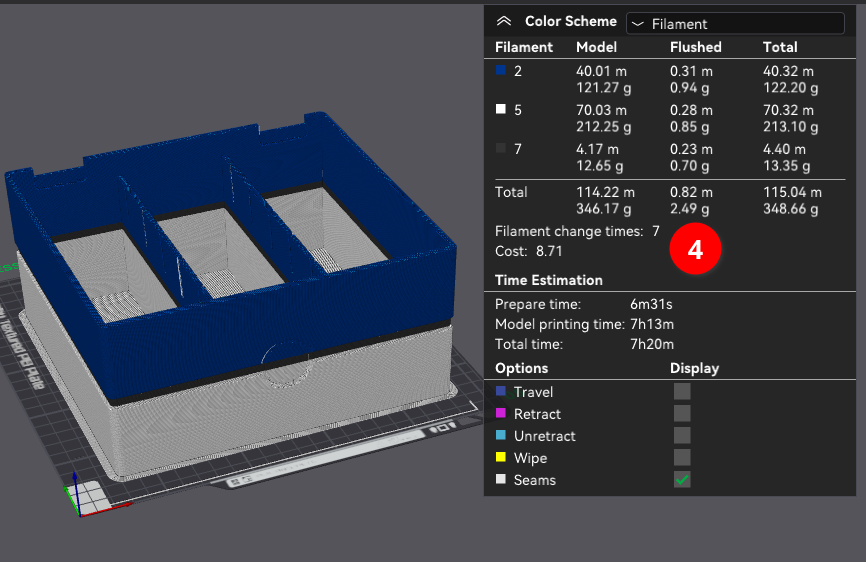

# Before and Optimal Target
The box is very simple but the red markings (1) and white button (2) cause frequent filament swaps (3) and a slow prime tower (4) that adds ~9h to the optimal print time of ~7h if the object was a single color.  Since this is a simple shape with large contiguous color regions, we could disable the prime tower  (5) without a significant quality drop but for some reason that only reduces print time by 1h14m instead of 4h23m.

   

# Quick and Dirty
Very simple designs could be remixed entirely using the slicer's Cut tool (1) to separate out the problem areas with frequent color changes.  Even though the tool defines a cut plane (2), contiguous areas (3 and 4) can be re-assigned to the other side of the cut via right-click. 

   

The box can be auto-oriented (1) then re-colored (2) with the height range (3) brush for a signficant reduction in color swaps (4) and a nearly optimal print time.

   

Some problem with the mesh and the height range tool results in 7 color swaps, but the optimal 3 swaps can alternatively be achieved by assigning changes by layer. 

 

The front features should be oriented using "Lay on Face" then "Split to Objects" to separate the marks from the button.  The marks are merged back together (for grouping) then color can be applied to each object.  To minimize color swaps set the plate to Print by Object then Auto-Arrange to find the optimal spacing that avoid toolhead collisions.  The result is a very fast print with minimal color swaps of three pieces that can be manually glued back onto the box.

      

This quick and dirty remix is a proof-of-concept that it's possible reduce the box from 258 color swaps down to 5 and get within ~10m of the fastest possible single-color print time, but there's a few problems:
1. The black ring around the white button is lost.
2. The box lacks registration points to ensure perfect positioning of the button and marks.

So let's redraw this in CAD to clean everything up.