# Setup
Download the [latest Bambu Studio](https://github.com/bambulab/BambuStudio/releases) to follow along with the experiments using these settings:

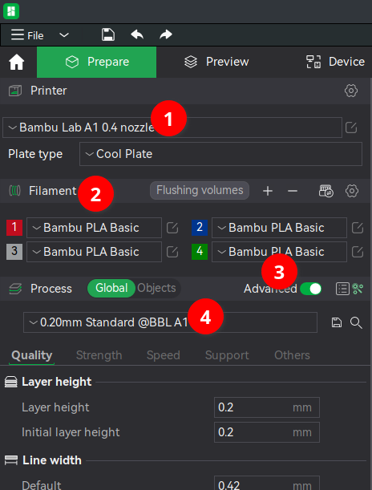

1. I own the A1 w/ AMS Lite.  P1P values should be similar, but you can easily switch the Printer and re-test.
2. The Bambu PLA Basic profile has a high max flow setting for fast printing.
3. Advanced settings allow more variables for testing.
4. Using the Standard quality baseline, but we'll discuss speed tradeoffs.

# Absolute Fastest Print Time
Add a simple single color cube (via right click) then slice it to see the maximum speed possible print speed (18m26s).

Briefly switch the Printer to `Bambu Lab P1P 0.4 nozzle` if you want to know if a CoreXY machine with the AMS is that much faster.  There's not much difference (19m23s) since this model isn't very large and there aren't many tiny features where a CoreXY's accelerations might reach faster speeds. 

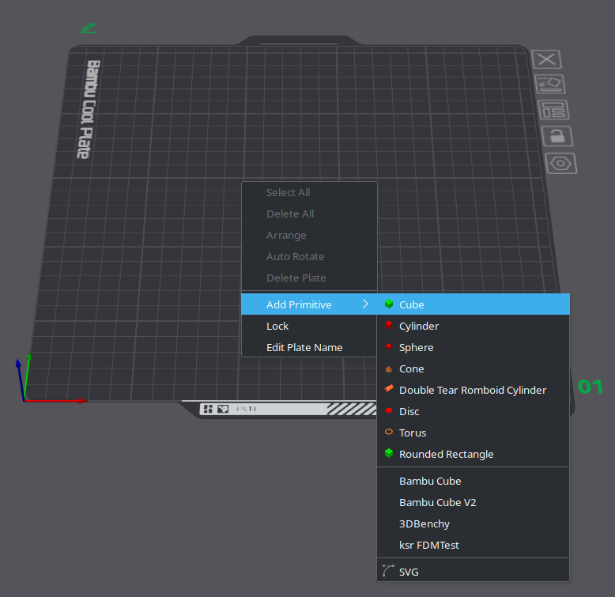 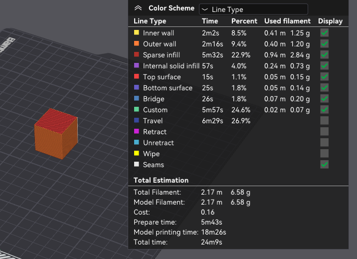 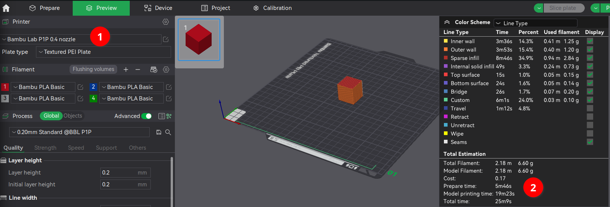

# Minimal Color Change Time
Switch the Printer back to `Bambu Lab A1 0.4 nozzle` then apply some color:
1. select the Color Painting tool
2. with a different filament color
3. using the Height Range brush
4. with a large Height Range of 8mm
5. to paint the top half of the cube blue

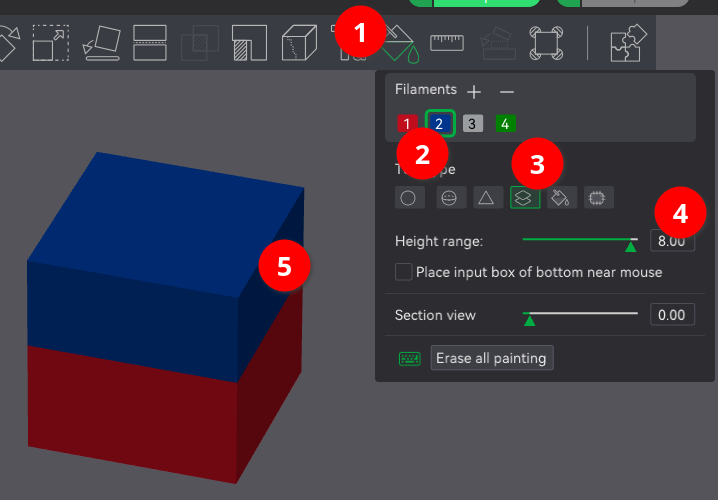

then slice to see the time increase (23m32s)

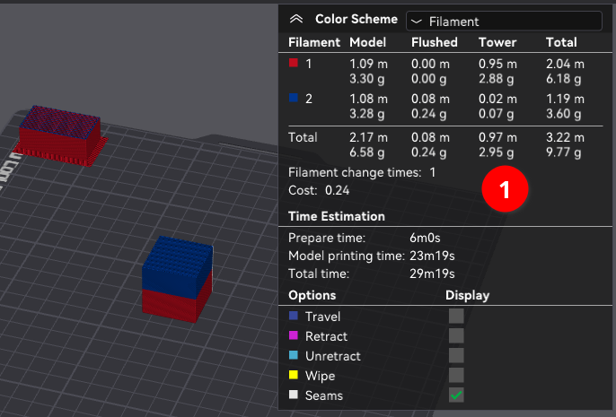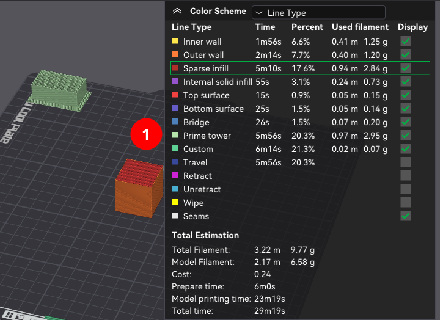

The [Prime Tower](https://wiki.bambulab.com/en/software/bambu-studio/parameter/prime-tower) (1) adds 3g of filament and 6m to the print time, so let's disable it for now to get a feel for the pure AMS swap (cut, unload, load, flush).  The new print time is 19m18s so estimate the swap time at 58s.  Depending on the design, disabling the Prime Tower might not cause major print defects.

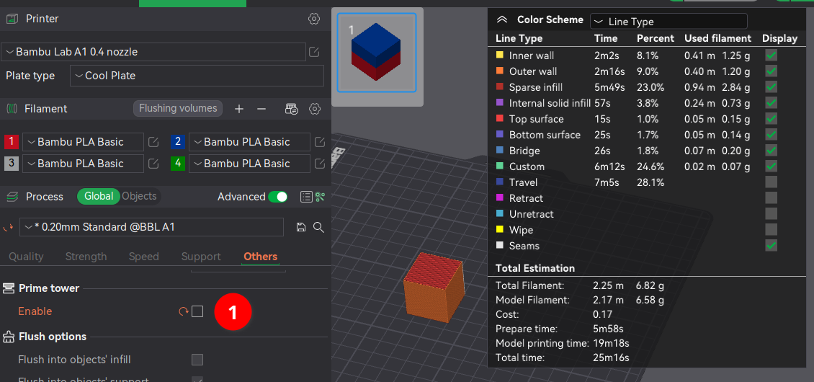 

Surprisingly adding 2 more filament swaps adds 3m12 (instead of 2m) so average swap time has increased to 1m23s likely due to different before/after color combinations requiring more [flush volume](https://wiki.bambulab.com/en/software/bambu-studio/reduce-wasting-during-filament-change) (2-4)

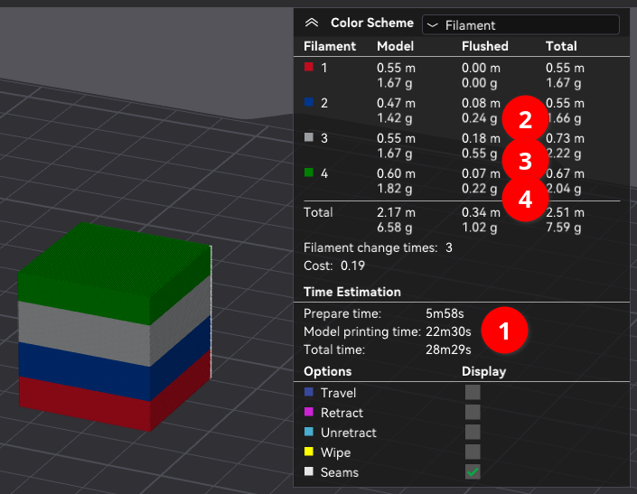

# Absolute Slowest Print Time
Make the worst possible decision and rotate the model to cause color swaps on every layer.  This adds 604m to our intial 18m print time and averages out to 1m33s per swap (the P1P profile is in the same ballpark).

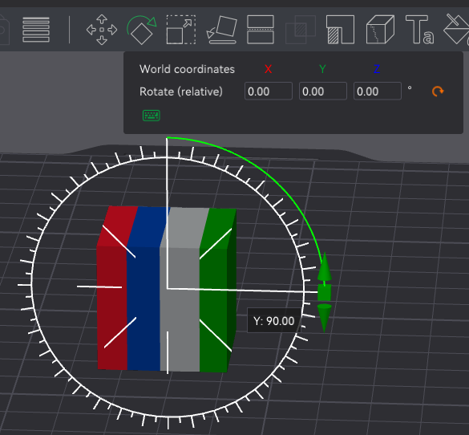 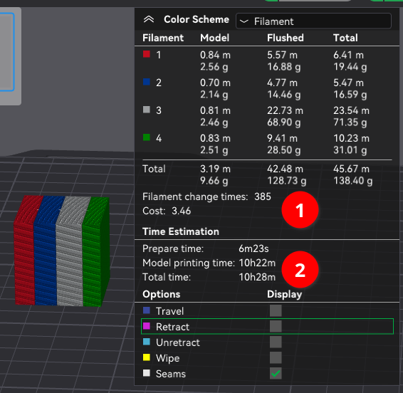

# Color swaps are evil, avoid!
The two previous experiments show the easiest speed optimization is re-orienting models to minimize color swaps.

What if you want to print multiple objects that are different colors on one plate?
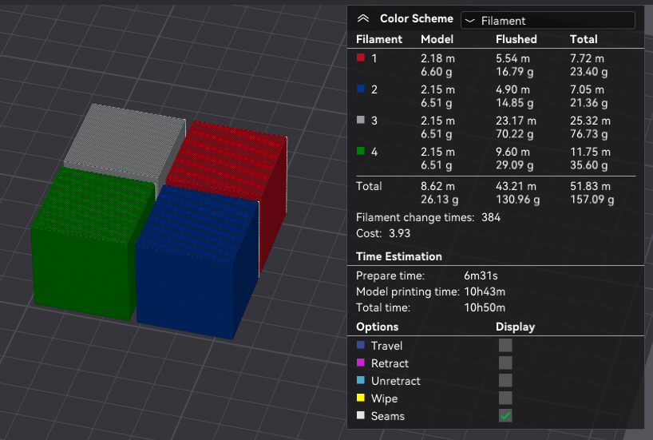

Use [Print by Object](https://wiki.bambulab.com/en/software/bambu-studio/sequent-print) so each single-color cube is fully printed before starting the next cube.  The highlight around each object is a buffer zone so when toolhead goes back down to a lower layer it doesn't collide with existing objects ([more details](https://wiki.bambulab.com/en/software/bambu-studio/sequent-print#limitations)).  On a P1P it's possible to use the Arrange tool to place all four cubes on one plate but on the A1 you can only fit 3.  This option also disables the Prime tower.

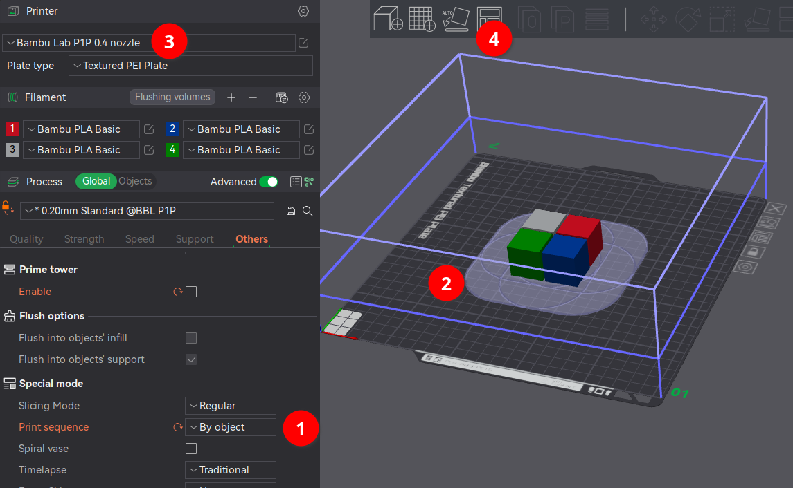 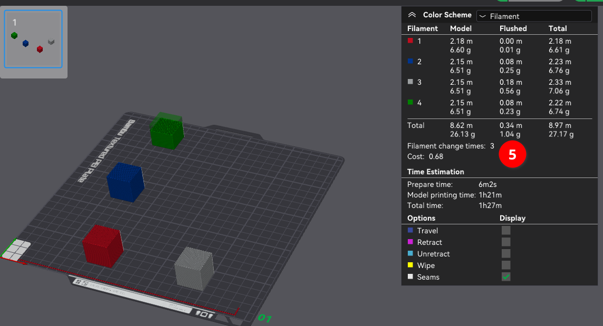

